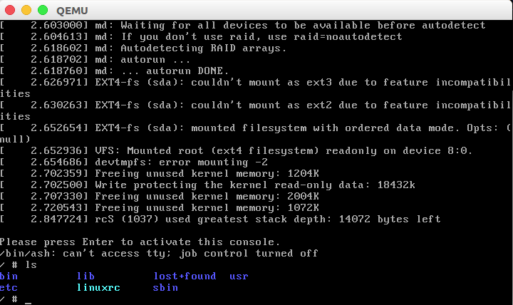

# &emsp;&emsp;&emsp;&emsp;&emsp;&emsp;操作系统(H)实验一
###&emsp;&emsp;&emsp;&emsp;&emsp;&emsp;&emsp;&emsp;&emsp;&emsp;&emsp;——追踪linux内核启动过程中的事件


-------------------


>本次操作系统实验的平台为Ubuntu 16.04 (LTS) ，实验内核为linux-4.15.14


###主要系统工具：
需要的操作大致有编译内核、创建磁盘镜像及根目录、使用 gdb 远程调试等，使用如下工具：
 
- **QEMU emulator**  2.5.0
- **busybox**              1.28.2
- **GUN gdb**              7.11.1
- **GCC**                      5.4.0

----------------------
### 实验环境搭建：

**编译内核代码**
从https://www.kernel.org/ 下载linux内核源码到本地,并解压编译
```bash
xz -d ***.tar.xz                    #解压
tar -xvf ***.tar
make x86_64_defconfig               #使用当前x86_64平台默认的配置
make -j8 bzImage                    #编译源码，此处使用“-j8"参数以加快编译速度
make modules                        #编译在配置阶段选择的内核模块
```
**制作磁盘镜像**
>linux内核启动时必须已有根文件系统来供内核加载，同时也用于存放编译好的内核模块

**使用qemu-img 创建一个2G的磁盘镜像文件**
```bash
qemu-img create -f raw disk.raw 2G                 #disk.raw文件就相当于一块磁盘
mkfs -t ext4 ./disk.raw                            #使用ext4文件系统格式化虚拟盘
mkdir rootfs 
sudo mount -o loop ./disk.raw ./rootfs             #将磁盘镜像文件挂载到rootfs目录上
sudo make modules_install INSTALL_MODPATH=./rootfs #安装内核模块到磁盘镜像中
```


**准备init程序**

为了完整启动内核到用户态，需要准备一个1号进程(init进程)供内核启动
这里选用busybox作为init程序以及其他命令工具的提供方
下载busybox源码准备编译，这里使用busybox 1.28.2的最新版本
```bash
make defconfig                      #默认配置生效
make menuconfig                     #定制配置，因为 busybox 将被用作 init 程序，而且磁盘镜像中没有任何其它库，所以busybox 需要被静态编译成一个独立、无依赖的可执行文件，以免运行时发生链接错误。
make CONFIG_PREFIX=./rootfs install #安装busybox到镜像文件挂载目录
```
**启动qemu虚拟机**
```bash
qemu-system-x86_64 \
    -m 1024M       \                                 # 指定内存大小
    -smp 4         \                                 # 指定虚拟的 CPU 数量
    -kernel ./bzImage \                              #内核映像路径
    -drive format=raw,file=./disk.raw \              #挂载格式
    -append "init=/linuxrc root=/dev/sda nokaslr" \  #指定init程序为根目录下linuxrc，这是一个软链接
    -gdb tcp::1234 \                                 #启动gdb服务
    -S             \                                 #开始时冻结CPU
```
**gdb远程调试**
>另开一个终端启动gdb服务
```bash
file ~/OSH/linux-4.15.14/vmlinux   #加载符号表
target remote :1234                #链接虚拟机gdbserver
c                                  #运行系统以测试
```


**启动完成后如下，内核启动完毕**


----------
###内核代码


```cpp
asmlinkage __visible void __init start_kernel(void)
{
        char *command_line;
        char *after_dashes;

        set_task_stack_end_magic(&init_task);
        smp_setup_processor_id();
        debug_objects_early_init();

        cgroup_init_early();

        local_irq_disable();
        early_boot_irqs_disabled = true;

        /*
         * Interrupts are still disabled. Do necessary setups, then
         * enable them.
         */
        boot_cpu_init();
        page_address_init();
```

----------
### 内核启动流程图
- **内核自解压阶段**
```flow
st=>start: CPU上电工作
e=>end: 调用start_kernel,进入引导阶段
op1=>operation: 从CS:IP=FFFF:0000入口处载入BIOS
op2=>operation: 
op3=>operation: 创建页表(__create_page_tables)
op4=>operation: 使能MMU(__enable_mmu)
op5=>operation: 复制数据段，清除BSS段
st->op1->op2->op3->op4->op5->e

```
- **内核引导阶段**
```flow
st=>start: start kernel
e=>end
op1=>opertaion: 输出版本信息(linux)
op2=>

st->e
```
- **内核初始化阶段**


gdb调试
另开一个终端启动gdb服务
file ~/OSH/linux-4.15.14/vmlinux   #加载符号表
target remote :1234   #链接虚拟机gdbserver
break start_kernel    #设置一个断点执行到start_kernel处

系统是从BIOS加电自检，载入MBR中的引导程序(LILO/GRUB),再加载linux内核开始运行的，一直到指定shell开始运行告一段落，这时用户开始操作Linux。而大致是在vmlinux的入口startup_32(head.S)中为pid号为0的原始进程设置了执行环境，然后原始进程开始执行start_kernel()完成Linux内核的初始化工作。包括初始化页表，初始化中断向量表，初始化系统时间等。继而调用 fork(),创建第一个用户进程:  

kernel_thread(kernel_init, NULL, CLONE_FS | CLONE_SIGHAND);

　　这个进程就是著名的pid为1的init进程，它会继续完成剩下的初始化工作，然后execve(/sbin/init), 成为系统中的其他所有进程的祖先。关于init我们这次先不研究，回过头来看pid=0的进程，在创建了init进程后，pid=0的进程调用cpu_idle()演变成了idle进程。

　　总而言之，系统启动后首先执行一系列的初始化工作，直到start_kernel处，它是代码的入口点，相当于main.c函数。然后启动系统的第一个进程init，init是所有进程的父进程，由init再启动子进程，从而使得系统成功运行起来。
